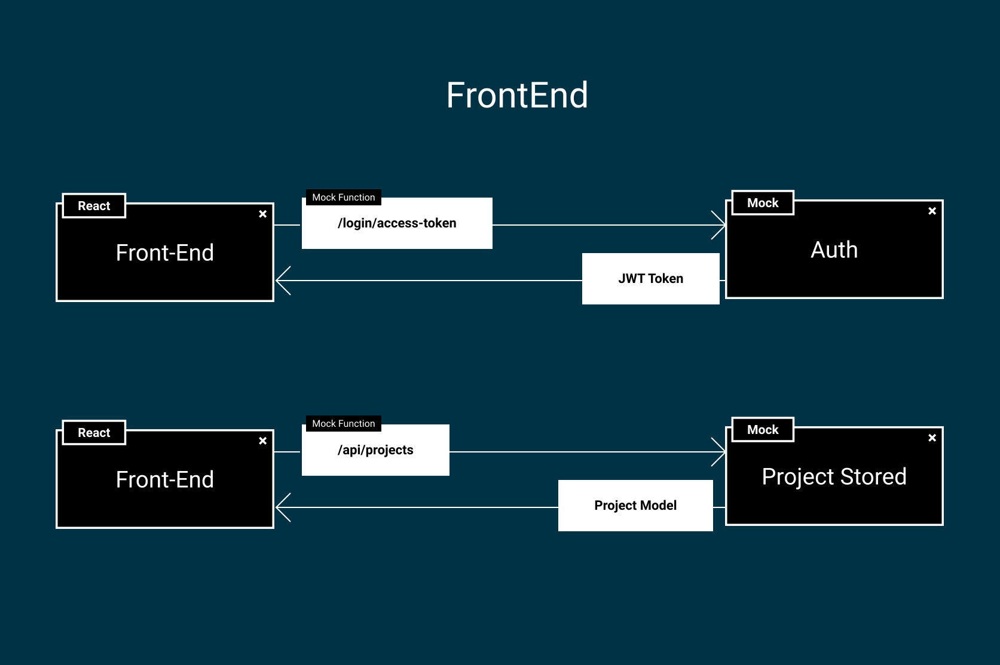

# Proyecto Web - Front

Primera sesión del Taller Proyecto Web. En esta primera sesión nos centraremos en el Front-End.



## Documentación

Puedes encontrar la documentación de este proyecto en [este enlace](https://taller-threepoints-docs.netlify.app/docs/frontend/intro).

## Prototipo

Una versión interactiva del proyecto se puede encontrar en la [Página de Figma](https://www.figma.com/proto/3e43h8TrzwpjfKwXvFxZoP/Taller?page-id=144%3A51&node-id=147%3A3&viewport=254%2C48%2C0.21&scaling=min-zoom&starting-point-node-id=147%3A3).

Además, como se enseñará en el propio proyecto, podemos ver el prototipo final en [este link](https://taller-threepoints-1.netlify.app/)

## Setup

Para poner en marcha el proyecto tenemos que seguir los siguientes pasos:

1. Añadir los paquetes con ```npm install```

2. Crear una sesión de desarrollo con ```npm run start```

3. Si queremos la webapp compilada, solo tendremos que ejecutar ```npm run build```

## Proyecto

Los detalles del proyecto se pueden consultar en su [documentación oficial](https://taller-threepoints-docs.netlify.app).
